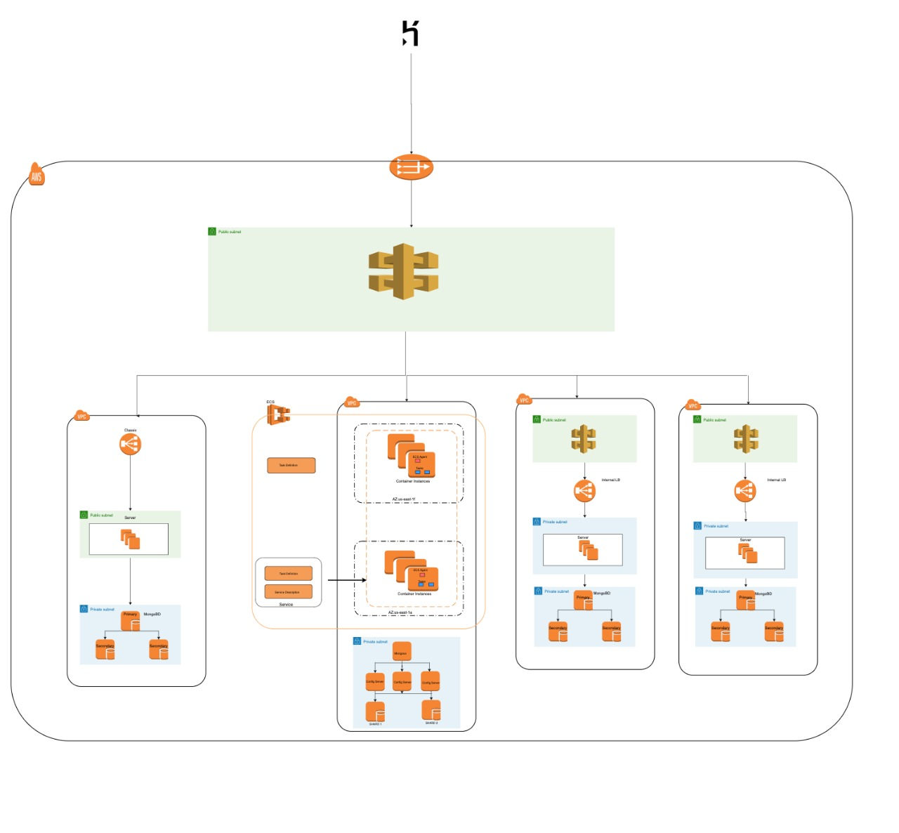
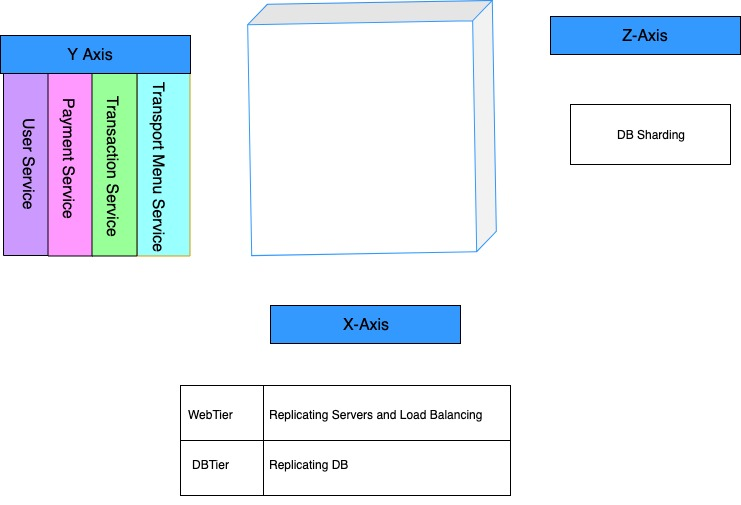

### :station: :bike: Project Title: **E-Clipper app** :bus: [Reference Link](https://www.futureofclipper.com/)

### :whale: Team: Whales :whale:

### Team Members And Modules :computer:

 * [Greeshma Vyas](https://github.com/greeshmavyas) - UserRegistration
 * [Manjunatha Koni Gururaja](https://github.com/konman01) - ClipperMenu
 * [Prathamesh Karve](https://github.com/PrathamR) - TransactionsHistory
 * [Saliha Mehboob](https://github.com/salihasjsu) - Payment
 
 ### Link to the application
 https://eclipper-cmpe281.herokuapp.com/#!/home
 
 ### Project Presentation
 https://docs.google.com/presentation/d/1LdSi3KjYjM4I2fLLjZgjWd_RIX2wu2dHI6qJO6O0C5o/edit?usp=sharing
 
 ### Application Overview
 
The management of fare for number of transportation services can be electronically managed using the clipper card. The clipper card that is currently being used is probably based on the technology that has RFID to detect and sync the payment information. Aging equipment and new technologies have made the current card-based system increasingly obsolete, lacking features, such as mobile phone integration or the ability to immediately use value purchased online.

We have taken our team project as an oppurtunity to build a SAAS application incorporating the most important features like access to many services from the same application, providing the services available based on the location, payment done online, facility check the previous transactions performed etc. We have also provided scope for new features to be added. It is designed to achieve scaling along all the axes of AKF cube hence catering the needs for it to be eventually scaled large enough as the number of users grow. 

### Technologies Used
Backend: GoLang, MongoDB, NodeJs  
Frontend: AngularJs, Bootstrap
 
### Summary Of Every Module

**User Registration**
This modules handles the login and sign Up of any user. The sign up modules gathers all the data of customer. It also provides a backward compatability with the existing card based system. That is, it lets the user create an account by linking their already existing clipperId so that their earlier payment balance is still available for their use. The login function authenticates the user by checking for an account-password pair. The authenticated state is maintained by the login module in the front end for the other services to be able to identify the user and perform the desired action.

MongoDB replication is used to store the user collections. The backend is coded in go language providing handlers for every possible APIs. The front end is done in angularjs with a view to have a theme of that in existing clipper website

**Menu**
The menu service is to display the available services offerend for clipper account holders. The user can provide his location by specifying the Zip Code and obtain the corresponding services which are supposed to be more relavant at that particular location.

**Paymemnt**
Payment Module allows user to recharge account and order any trasnport service.
After the use logged in, a user can check his current balance by going to Payment tab of the application. The user can recharge his account by adding funds to his account. He can also provide payment methods to be used for recharging account. Moreover, a user can order any service by going to the At Your location? tab, there a user can select a service and can order it. The payment module is implemented in GOLang and is hosted on AWS sing aws Elastic Container Service. The Application load balancer is handling the request to the containers. The database of payment module supports Sharding and contains a query router, 3 config servers and 2 shard replica.

**Transactions History**
Every purchase that is successfully paid for will get logged in the TransactionsHistory module. This module will keep a log of the exact date and time when the purchase happened, what service was bought and what was the amount spent. This log is shown to the user if s/he is logged in.
MongoDB was the choice of database for this module because of its suitability to structed data and schema-less flexibility.
Trans History maintains an always-accesible log of services bought by the user.
Designed and developed the TransactionsHistory microservice. GoContainerized the microservice and deployed it to multiple docker hosts in AWS. Deployed a MongoDB replica set as the datastore for this service. Deployed Kong API Gateway and load-balancer to handle traffic. Developed a front-end module for the microservice to add new transactions and retrieve them for a user.

### Architecture

### AKF Cube scaling 

